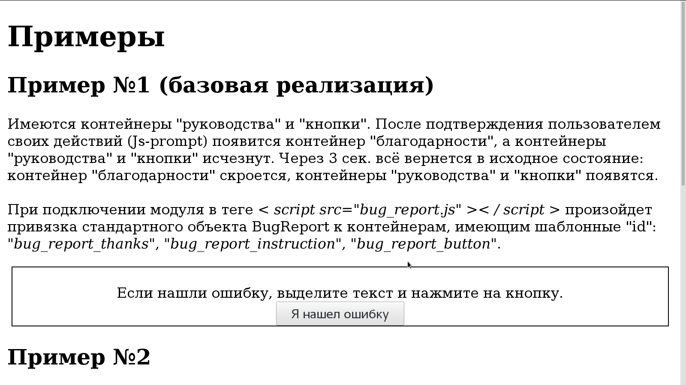

# BugReport 

BugReport - JS-пакет, чей функционал дает возможность отсылать уведомления пользователями сайта о наличии ошибки в тексте на сайте.

См. GIF-анимацию:
<kbd></kbd>   

## Как использовать у себя

### Базовый вариант

Подключите модуль перед закрывающимся тегом `</body>`. Я попозже сделаю нормального "ждуна" для этой библиотеки, но пока так.

```html
<script src="./bug_report.bundle.js"></script>
```

В вашем HTML-файле создайте соотсветствующие контейнеры (расстановка контейнеров и их CSS за вами).

```html
<div id="bug_report_thanks" style="visibility:hidden">
        Благодарю Вас!
</div>
<div id="bug_report_instruction">
    Если нашли ошибку, выделите текст и нажмите на кнопку.
</div>
<button id="bug_report_button">
    Я нашел ошибку
</button>
```

Имеются контейнеры "руководства" и "кнопки". Пользователь выделит текст, нажмет на "Я нашел ошибку". Выскочит JS-prompt. После подтверждения пользователем своих действий появится контейнер "благодарности", а контейнеры "руководства" и "кнопки" исчезнут. Через 3 сек. всё вернется в исходное состояние: контейнер "благодарности" скроется, контейнеры "руководства" и "кнопки" появятся.
 
 При подключении модуля автоматически произойдет привязка стандартного объекта BugReport к соответствующим контейнерам, имеющим шаблонные "id": 
 * "bug_report_thanks"
 * "bug_report_instruction"
 * "bug_report_button"
    

### Дополнительная форма BugReport

Если Вам необходимо определить дополнительную форму, то добавте соответствующие контейнеры и привяжите к ним объекты BugReport.

#### Внутри HTML
```html
<div id="example_bug_report_thanks" style="visibility:hidden;">
    Дзякуй Вам!
</div>
<div>
    Калі знайшлі памылку, вылучыце тэкст і націсніце на кнопку.
</div>
<button id="example_bug_report_button">
    Я знайшоў памылку
</button>
```
Имеется контейнер "кнопки", а контейнер "руководства" <b><u>отсутствует</u></b> (специально). После подтверждения пользователем своих действий появится контейнер "благодарности", а контейнер "кнопки" исчезнет. Через 3 сек. всё вернется в исходное состояние: контейнер "Благодарности" скроется, контейнер "кнопки" появится.

Для привязки создайте объект BugReport:
```html
<script>
let example_bug_report = new BugReport(
    name='example',
    promptMessage='Патлумачце дадаткова і пакажыце кантактныя дадзеныя, калі хочаце.'
);
</script>
```

Необходимо заметить, что с целью унификации объектов и их привязки я решил использовать у объекта поле `name`, при его определении соответствующие контейнеры должны иметь "id":
* name + "_" + "bug_report_thanks"
* name + "_" + "bug_report_instruction"
* name + "_" + "bug_report_button"

То есть при `name='example'` это:
* "example_bug_report_thanks"
* "example_bug_report_instruction"
* "example_bug_report_button"

#### В пользовательском JS-файле

Все тоже самое вы можете вынести в свой JS-файл, например, 'my_bug_report.js':

```html
let my_bug_report = new BugReport(
    name='my',
    promptMessage='Leave a comment and contact to contact you if you want.'
);
```

и подключить его:

```html
<script src="./my_bug_report.js"></script>
```

Контейнеры будут иметь тогда такие "id":

```html
<div id="my_bug_report_thanks" style="visibility:hidden;" class="thanks">
    Thank you!
</div>
<div id="my_bug_report_instruction">
    If you find an error, select the text and click the button.
</div>
<button id="my_bug_report_button">
    I find error
</button>
```

Пример совпадает с базовым.
    

## Проверка работоспособности

Откройте проектный index.html в браузере


Через 3 секунды форма BugReport появится снова, а благодаственное сообщение пропадет.

## Авторы

* **BorisPlus** - [https://github.com/BorisPlus/BugReport](https://github.com/BorisPlus/otus_webpython_018)

## Лицензия

Свободно

## Дополнительные сведения

Проект в рамках домашнего задания курса "Web-разработчик на Python" на https://otus.ru/learning
